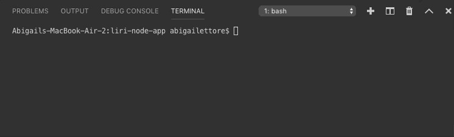

# liri-node-app

<h1> LIRI Bot </h1>

In this assignment, you will make LIRI. LIRI is like iPhone's SIRI. However, while SIRI is a Speech Interpretation and Recognition Interface, LIRI is a Language Interpretation and Recognition Interface. LIRI will be a command line node app that takes in parameters and gives you back data.

<h2>Node Packages Used</h2>

Node-Spotify-API
OMDB API
Bands in Town API
Moment
DotEnv

<h3>App Organization</h3>

